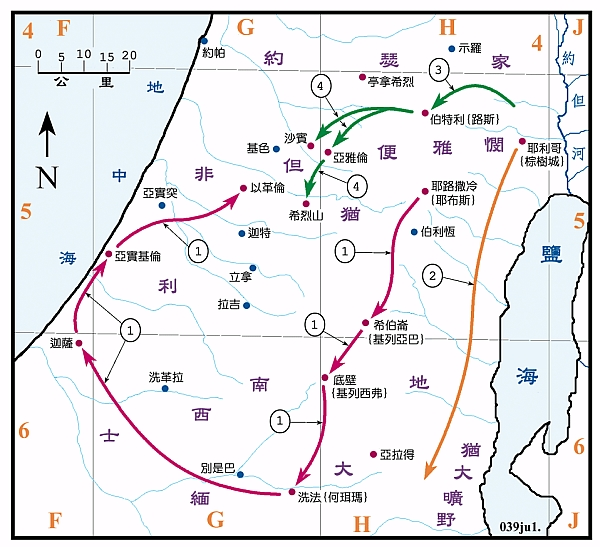
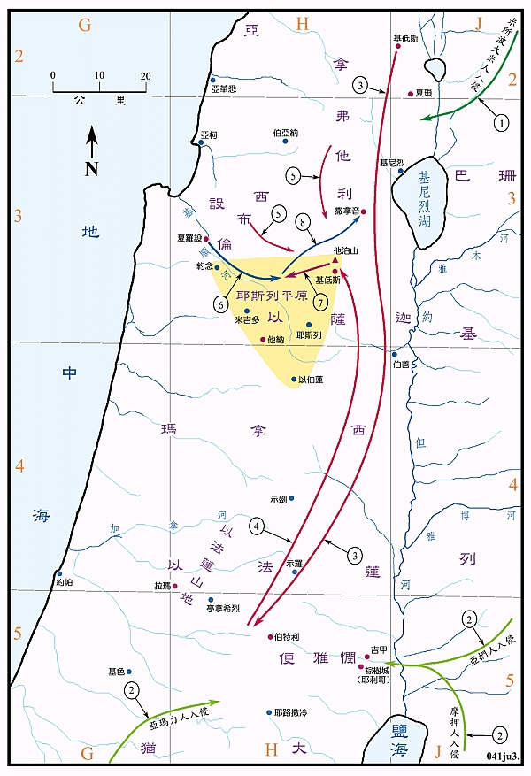
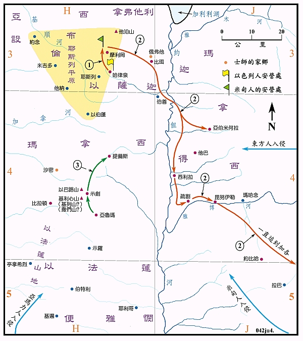
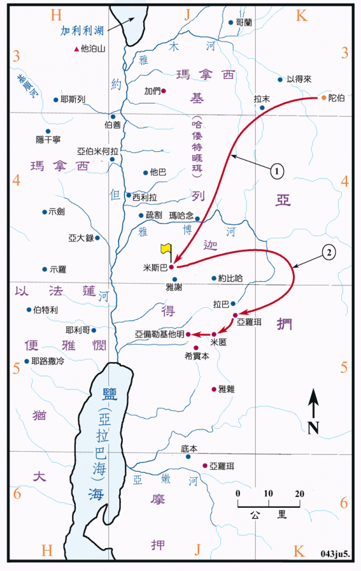
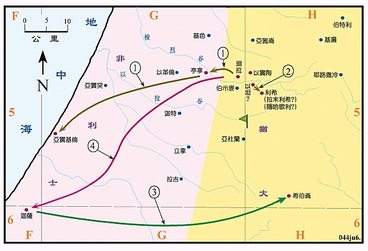
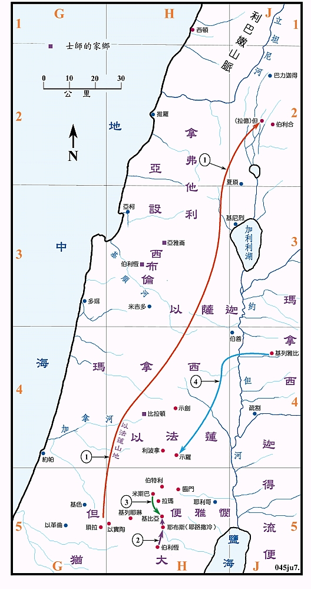

# 士師記

#### 1. 攻取南部之地

*士1:1，2:8-9 约书亚活到一百一十岁，约是在1390BC 去世，葬在亭拿希烈。

**1.** **士** **1:1-26** **犹大、西缅和以法莲攻取南部之地，包括有耶路撒冷、希伯崙、底壁、洗法、迦萨、亚实基伦、以革伦等地。**

**2.** **士** **1:16** **基尼人离开棕树城，往亚拉得以南的犹大旷野去住在那里。**

**3.** **士** **1:22-26** **约瑟家攻取了伯特利。**

**4.** **士** **1:35** **约瑟家攻取了希烈山、亚雅伦和沙宾。**

士师记是记载约书亚至撒母耳之间的歷史，大约是从1400BC到1100BC年间的事，各士师之年代，经考据分别记载在各图之说明中。

约书亚虽然带领以色列人征服迦南地，但并未消灭所有的迦南人，不久迦南人又强大了起来，新一代的以色列人必须再去征服失去之地。

本段中只记载了犹大、西缅、便雅悯和约瑟家(即是以法莲和玛拿西)等五个支派的战事，他们收復了伯特利以南的地区。但是并未能赶出耶路撒冷的耶布斯人。犹大攻取了非利士人的三个主要城镇，但照第十九节的说法，似乎并没有能长久的佔领。

#### 2. 俄陀聂、以笏和底波拉 

**1.** **士** **3:7-11** **米所波大米人入侵，使以色列人服事了他们八年。俄陀聂兴起拯救，于是国中平静了四十年。**

**2.** **士** **3:12-28** **摩押人招聚了亚扪人和亚玛力人入侵，使以色列人服事了他们十八年。以笏兴起拯救，于是国中太平了八十年。**

**士4:1-3 迦南人夏琐王欺压以色列人二十年。**

**3.** **士4:4-7底波拉作以色列人的士师，她召基低斯的巴拉到伯特利和拉玛附近她的家中，令他攻击夏琐王。**

**4.** **士4:8-9 底波拉和巴拉同去基低斯。**

**5.** **士4:10-12 巴拉召集西布伦人和拿弗他利人** **(** **可能还有以萨迦人** **)** **共一万人到基低斯。**

**6.** **士4:13 夏琐王的将军西拉拉从夏罗设出来攻打以色列人，到了基顺河。**

**7.** **士4:14-15 以色列人从他泊山下来，击败了西拉拉的大军。**

**8.** **士4:15-22 西拉拉兵败后逃亡，到了撒拉音的橡树旁，被基尼妇人雅亿所杀。**

#### 3. 基甸、亚比米勒和陀拉 Gideon, Abimelech and Tola

***士6:1-35 米甸压制以色列人七年，耶和华召基甸出来拯救，他召集玛拿西、亚设、西布伦和拿弗他利支派的人来跟从他，共约有三万二千人。

*士7:1-8 基甸在哈律泉旁安营，他选了三百人，将其他的人遣回。

**1.** **士** **7:16-21** **基甸攻打米甸人，米甸人大败。**

**2.** **士** **7:21-8:12** **米甸人逃窜，直到加各。**

**3.** **士** **9** **章** **亚比米勒为患三年。**

*士10:1-2 沙密的陀拉作以色列人的士师二十三年。

####4. 睚珥和耶弗他 Jair and Jephthah

*士10:4-5 基列人睚珥作以色列人的士师廿二年。

*士10:6-12:7 亚扪人欺压基列地的以色列人有十八年之久，以色列人安营在米斯巴，但没有领袖。

**1.** **士** **11:1-11** **以色列人去陀伯地请回耶弗他，立他作以色列人的领袖。**

**2.** **士** **11:32-33** **以色列人攻击亚扪，亚扪人就被制服了。**

*士12:1-6 以法莲人责怪并攻打耶弗他，被耶弗他所败。

#### 5.参孙 Samson

*士13 章 非利士人欺压以色列人四十年，耶和华使 **但** 族的玛挪亚生了参孙，以拯救以色列人。

**1.** **士** **14:1** **参孙到亭拿要娶非利士女子为妻，他下到亚实基伦击杀了三十个非利士人。**

*士15:1-8 参孙用狐狸烧了非利士的禾稼和葡萄园，非利士人就烧了他的妻子和岳父，他为妻子报仇，再杀了许多非利士人，然后下去住在以坦。

**2.** **士** **15:9-20** **犹大人在以坦把参孙捆绑了，送到利希非利士人那里，参孙在那里击杀了一千多个非利士人。参孙作以色列的士师二十年。**

**3.** **士** **16:1-3** **参孙到迦萨，半夜起来，把城门拆下来，扛到希伯崙城的山顶上。**

**4.** **士** **16:4-31** **参孙在梭烈谷被大利拉探知他有力的祕密，就被非利士人捉到迦萨，剜了他的眼睛，使他做苦工，结果参孙在被戏辱之时，将大庙推倒，压死了许多的非利士人﹐他也被压身亡。**

#### 6. 米迦的偶像，利未人的妾

*士12:8-10 伯利恆人以比赞作以色列人的士师七年。

*士12:11-12 西布伦人以伦作以色列人的士师十年。

*士12:13-15 比拉顿人押顿作以色列人的士师八年。

**1.** **士** **18** **章** **但支派攻取拉亿城，改名但城，在那里居住。**

**2.** **士** **19:1-28** **一个利未人带着他的妾从伯利恆到了基比亚，在基比亚他的妾被辱致死。**

**3.** **士** **19:29-20:48** **以色列人集合在米斯巴，攻打基比亚，又烧杀了便雅悯的各城，便雅悯几被灭族。**

**4.** **士** **21:9-12** **以色列攻打基列雅比，又将剩余的四百个处女带到示罗给便雅悯人为妻。**